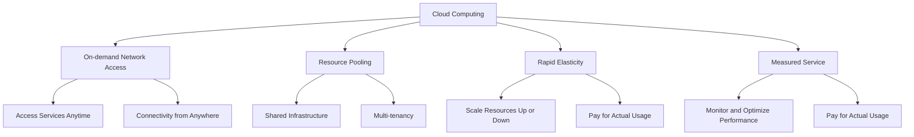

# 📄 Introduction to Cloud Computing 
---
## 📋 Overview
Welcome to the "Introduction to Cloud Computing" workshop! In this session, we will explore the world of cloud computing and its applications. Cloud computing has revolutionized the way businesses and individuals store, manage, and process data. This workshop aims to provide you with a solid foundation in cloud computing concepts, services, and benefits. 

## 🎯 Objectives
By the end of this workshop, you will:

- Understand the fundamental concepts of cloud computing. 
- Learn about different cloud service models and deployment models.
- Explore popular cloud service providers.
- Gain hands-on experience with cloud resources and services. 
- Understand the benefits and challenges of cloud adoption. 

## 🔍 Prerequisites
To participate in this workshop, you should have a basic understanding of computer systems and networking. Familiarity with programming concepts and the command line interface will be beneficial. Please ensure you have the following requirements met:

- Laptop with internet connectivity. 
- Web browser (preferably Google Chrome or Mozilla Firefox).
- A valid email address to create accounts on cloud platforms. 

## 🚀 Workshop Outline

**The workshop will consist of the following sections:**

1. Introduction to Cloud Computing
    - Overview of cloud computing and its importance: 
        - Cloud Computing is defined as the practice of using remote servers hosted on the internet to store, manage and process data rather than using a local. 
    - Benefits and challenges of adopting cloud services. 


2. Cloud Service Models
    - Infrastructure as a Service (IaaS)
    - Platform as a Service (PaaS)
    - Software as a Service (SaaS)

        | Category | Service Model | Examples |
        | --- | --- | --- |
        | IAAS | Infrastructure as a Service | Amazon EC2, Azure Blob Storage, Google Cloud VPC |
        | SAAS | Software as a Service | Gmail, Google Docs, Salesforce |
        | PAAS | Platform as a Service | Heroku, Azure App Service, AWS RDS |
    

3. Cloud Deployment Models
    - Public, private, hybrid, and multi-cloud environments. 
    - Considerations for choosing a deployment model. 

    | Cloud Deployment Models | Considerations |
    | --- | --- |
    | Public Cloud | Scalability, Cost, Convenience |
    | Private Cloud | Control, Security, Compliance |
    | Hybrid Cloud | Flexibility, Data Sovereignty, Cost |
    | Multi-cloud | Vendor Lock-In, Redundancy, Data Portability |


4. Popular Cloud Service Providers
    - Amazon Web Services (AWS)
    - Google Cloud Platform (GCP) 
    - Microsoft Azure 
    ```mermaid
    graph LR
    E[Cloud Service Providers] --> A[AWS]
    E --> B[GCP]
    E --> C[Azure]
    ```


5. Hands-on Cloud Experience
    - Account setup on a cloud platform. 
    - Provisioning virtual machines and storage resources. 
    - Deploying and managing applications on the cloud. 
    ```mermaid
    graph LR
    A[Hands-on Cloud Experience] --> B[Account Setup]
    A --> C[Provisioning Resources]
    A --> D[Deploying and Managing Applications]

    B -- Choose Cloud Platform --> E[Create Account]
    B -- Set Up Billing --> F[Configure Payment Method]
    B -- Configure Security --> G[Set Up Authentication]

    C -- Select Virtual Machines --> H[Provision VM Instances]
    C -- Choose Storage Options --> I[Allocate Storage Resources]
    C -- Define Networking --> J[Set Up Virtual Networks]

    D -- Prepare Application --> K[Containerize/Package Application]
    D -- Choose Deployment Method --> L[Deploy Application]
    D -- Configure Monitoring --> M[Set Up Application Monitoring]
    D -- Perform Updates --> N[Manage Application Lifecycle]
    ```

6. Cloud Security and Best Practices
    - Overview of cloud security concerns. 
    - Best practices for securing cloud resources. 
    - Compliance and data privacy considerations. 

    | Topic | Description |
    | --- | --- |
    | Security Concerns | Data breaches, identity and access management, vulnerabilities and threats, data loss or leakage |
    | Best Practices | Secure configuration, network segmentation, incident response, user awareness and training |
    | Compliance and Data Privacy | Compliance standards, data privacy regulations, data residency requirements |


7. Real-World Cloud Applications
    - Case studies and examples of cloud adoption. 
    - Industry-specific use cases. 

    | Cloud Applications | Case Studies and Examples | Industry-Specific Use Cases |
    | --- | --- | --- |
    | Infrastructure as a Service (IAAS) |  Netflix: Migrated its video streaming platform to AWS, leveraging its scalability and global reach. |  E-commerce: Hosting websites and managing scalable infrastructure for online retail. |
    | Software as a Service (SAAS) |  Salesforce: Provides customer relationship management (CRM) software as a cloud-based service. |  Healthcare: Managing electronic health records and telehealth solutions. |
    | Platform as a Service (PAAS) |  Heroku: Offers a cloud application platform for developers to deploy and scale applications. |  Financial Services: Building and deploying fintech applications for banking and investment management. |
    | Cloud Storage and Backup |  Dropbox: Provides cloud storage and file synchronization services for individuals and businesses. |  Media and Entertainment: Storing and streaming large media files for content distribution. |
    | Big Data and Analytics |  Airbnb: Utilizes cloud-based data analytics to gain insights into user behavior and optimize pricing. |  Manufacturing: Analyzing sensor data for predictive maintenance and optimizing production processes. |
    | Internet of Things (IoT) |  Philips Hue: Cloud-based smart lighting system enabling remote control and automation. |  Smart Cities: Collecting and analyzing data from connected devices to improve urban infrastructure. |


8. Future Trends in Cloud Computing
    - Serverless computing
    - Edge computing
    - Artificial Intelligence (AI) and Machine Learning (ML) in the cloud 
    ```mermaid
    graph LR
    A[Future Trends] --> B[Serverless Computing]
    A --> C[Edge Computing]
    A --> D[AI and ML in the Cloud]

    B --> B1[Automatic Scaling]
    B --> B2[Cost Optimization]
    B --> B3[Event-driven Execution]

    C --> C1[Reduced Latency]
    C --> C2[Real-time Processing]
    C --> C3[Beneficial for IoT and Data-intensive Workloads]

    D --> D1[Scalable Infrastructure]
    D --> D2[Development, Training, and Deployment of AI/ML Models]
    D --> D3[Pre-built AI Services]
    ```


## 🌐 Additional Resources
To continue your learning journey beyond this workshop, here are some recommended resources:

1. Books:
    - "Cloud Computing: Concepts, Technology & Architecture" by Thomas Erl, Ricardo Puttini, and Zaigham Mahmood 📚
    - "Cloud Native: Using Containers, Functions, and Data to Build Next-Generation Applications" by Boris Scholl, Trent Swanson, and Peter Jausovec 📚

2. Online Courses:
    - Coursera: "Cloud Computing Basics" by University of Illinois at Urbana-Champaign 🖥️
    - FreeCodeCamp : "AWS Certified Cloud Practitioner Training 2020" by Andrew Brown 🎓


---

 *To make such stunning visual documentation you can refer to the [MarkDown Tutorial](https://ahmedthahir.github.io/gdscbpdc/2022-2023/02_Markdown/) by GDSC!*


            